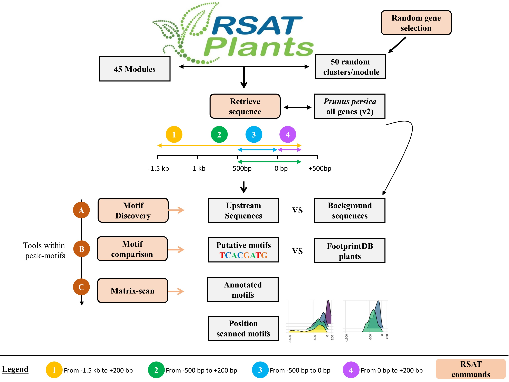

This repository documents recipes to discover cis-regulatory motifs within proximal promoters of plants in [RSAT::Plants](http://rsat.eead.csic.es/plants). 

The reports and data in [Modules/](./Modules/) correspond to the benchmark experiment with peach expression-based gene modules.

URL: [eead-csic-compbio.github.io/coexpression_motif_discovery](https://eead-csic-compbio.github.io/coexpression_motif_discovery)

**Authors**

N Ksouri (1), JA Castro-Mondragón (2,3), F Montardit-Tardà (1), J van Helden (2), B Contreras-Moreira (1,4,5), Y Gogorcena (1)

1. Estación Experimental de Aula Dei-CSIC, Zaragoza, Spain
2. Aix-Marseille Univ, Theory and Approaches of Genome Complexity (TAGC), Marseille, France.
3. Centre for Molecular Medicine Norway (NCMM), Nordic EMBL Partnership, University of Oslo, Norway.
4. Fundacion ARAID, Zaragoza, Spain
5. European Bioinformatics Institute EMBL-EBI, Hinxton, UK

Questions or comments, please contact: nksouri at eead.csic.es

**Peach results**

|-1.5Kb,+200b|-500b,+200b|-500b,0|0,+200b|
|:---------|:--------:|:---------|:--------:|
|[upstream1](./upstream1.html) | [upstream2](./upstream2.html)| [upstream3](./upstream3.html) | [upstream4](./upstream4.html)| 

