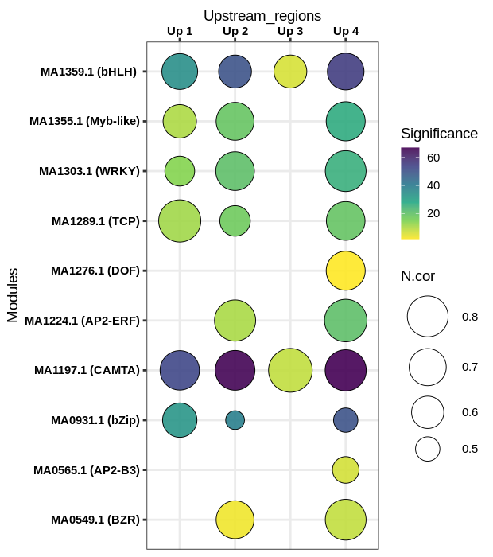

# R_scripts

This repository contains some helpful R scripts and datasets.
Before starting, make sure that you have installed
* R (version >=3.6.1)
* RStudio

# List of scripts

**1. Static and intercative bubble plot**: 

This script returns a bubble chart in which the bubble size corresponds to the normalized correlation (Ncor) and colors refer to the statistical significance.  

Using the Plotly's R graphing library, we can transforme the static chart to intercative one [See example](http://localhost:15345/session/viewhtml3b0f4687e847/index.html). The Plotly.R is free and open source.   

To reproduce this graph, kindly use the **[bubble_plot.R](R/bubble_plot.R)**  and **[bubble_athaliana.csv](data/bubble_athaliana.csv)**

**2. Density plot**: 
